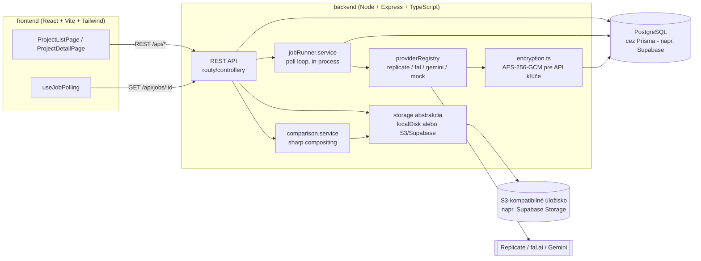

# DESIGNapp by Lucie Džama — AI vizualizácie interiérov „pred / po"

Webová aplikácia pre interiérových dizajnérov a ich klientov. Z reálnych fotiek
a pôdorysu pripraví zjednotenú fotorealistickú vizualizáciu súčasného stavu, zo
screenshotu SketchUp náčrtu vygeneruje fotorealistický render nového návrhu
(ControlNet depth+canny podmienenie zachováva geometriu náčrtu), a obe
vizualizácie zobrazí ako interaktívne porovnanie „pred / po" s exportom do PNG.

## Architektúra



**Prečo Node/Express/Prisma namiesto Python/FastAPI:** ControlNet depth/canny
preprocessing sa dá riešiť cez hostované modely na Replicate/fal.ai (žiadna
potreba lokálneho `controlnet-aux`), takže výhoda Pythonu tu odpadá. Node dáva
jeden jazyk pre celý monorepo, `sharp` (libvips) je rýchlejší ako Pillow pre
skladanie PRED/PO obrázkov.

**Prečo PostgreSQL (napr. Supabase) + S3-kompatibilné úložisko namiesto SQLite
a lokálneho disku:** bezplatné úrovne moderných hostingov appiek (Render, aj
Railway) nedávajú trvalý disk zadarmo - databáza aj nahraté súbory preto musia
žiť mimo appky, v spravovaných službách s vlastnou trvalosťou. Appka je na to
navrhnutá cez výmennú `storage` abstrakciu (`localDiskStorage` pre rýchly
lokálny vývoj bez účtov, `s3Storage` pre Supabase Storage/akékoľvek
S3-kompatibilné úložisko v produkcii) - stačí prepnúť `STORAGE_DRIVER`.

**Asynchrónne generovanie bez frontovacej infraštruktúry (Redis/BullMQ):**
`jobRunner.service.ts` beží ako in-process `setInterval` poll loop (max 2
súbežné joby), ktorý číta `PENDING` joby z DB a spracúva ich cez adaptér
zvoleného AI providera. Pri MVP záťaži (1 dizajnér + klient) je to dostatočné;
frontové riešenie by malo zmysel až pri horizontálnom škálovaní na viac
inštancií backendu.

## Inštalácia

Predpoklady: Node.js 20+ (testované na v24), npm, a **PostgreSQL databáza**
(najjednoduchšie: bezplatný projekt na [supabase.com](https://supabase.com) -
Project Settings → Database → Connection string).

```bash
# 1. Skopírujte .env.example
cp .env.example backend/.env
cp .env.example frontend/.env   # frontend číta len VITE_API_BASE_URL

# 2. V backend/.env doplňte DATABASE_URL (connection string zo Supabase)

# 3. Backend
cd backend
npm install
npx prisma migrate deploy   # vytvorí tabuľky v Postgres DB
npm run seed                # voliteľné: 1 demo projekt s placeholder obrázkami
npm run dev                 # beží na http://localhost:4000

# 4. Frontend (v novom termináli)
cd frontend
npm install
npm run dev                 # beží na http://localhost:5173
```

Appka je plne funkčná bez akýchkoľvek AI API kľúčov — každý provider, ktorého
kľúč chýba, automaticky prepne na `MOCK` režim (vráti placeholder obrázok,
cena $0). API kľúče sa dajú zadať aj priamo v appke na stránke **/nastavenia**
(uložia sa zašifrované do DB, majú prednosť pred `.env`) — po uložení sa kľúč
hneď overí a zobrazí sa farebný stav: zelená = funguje, červená =
neaktívne/chýba, oranžová = práve sa overuje.

Pre nahrávanie súborov môžete lokálne ostať pri `STORAGE_DRIVER=local`
(ukladá na disk do `backend/uploads`, netreba žiadny účet) - na `s3`
(Supabase Storage) treba prepnúť až pri nasadení bez trvalého disku (viď nižšie).

### Testy

```bash
cd backend
npm test          # unit testy adaptérovej vrstvy + šifrovania (mocknuté, bez DB)
npm run test:e2e  # e2e happy-path (vlastná Postgres test DB, migruje sa automaticky - nastavte TEST_DATABASE_URL)
```

## `.env` premenné

Viď [`.env.example`](.env.example) v koreni repozitára (skopírujte do `backend/.env`).

| Premenná | Popis |
|---|---|
| `PORT` | Port backendu (predvolené 4000; Render/hosting si ho zvyčajne nastaví sám) |
| `DATABASE_URL` | PostgreSQL connection string (napr. zo Supabase: Project Settings → Database) |
| `STORAGE_DRIVER` | `local` (disk, rýchly vývoj) alebo `s3` (S3-kompatibilné úložisko, napr. Supabase Storage - potrebné vždy, keď appka nemá trvalý disk) |
| `UPLOADS_DIR` | Priečinok pre lokálne súbory (len keď `STORAGE_DRIVER=local`) |
| `S3_ENDPOINT` / `S3_REGION` / `S3_ACCESS_KEY_ID` / `S3_SECRET_ACCESS_KEY` / `S3_BUCKET` | Potrebné len keď `STORAGE_DRIVER=s3` (Supabase: Storage → Settings → S3 Connection) |
| `REPLICATE_API_TOKEN` | API token z replicate.com/account/api-tokens |
| `FAL_API_KEY` | API kľúč z fal.ai/dashboard/keys |
| `GEMINI_API_KEY` | API kľúč z aistudio.google.com/apikey |
| `DEFAULT_PROVIDER` | Provider použitý, keď klient v requeste neuvedie `provider` (predvolené `MOCK`) |
| `ACCESS_PASSWORD` | Jednotné heslo pre celú appku. Prázdne = appka je bez hesla (len pre lokálny vývoj!) |
| `SESSION_SECRET` | Podpisuje prihlasovaciu cookie. V produkcii nastavte na dlhý náhodný reťazec, inak sa všetci odhlásia pri každom reštarte |
| `CREDENTIALS_ENCRYPTION_KEY` | Šifruje uložené AI API kľúče v DB (AES-256-GCM). V produkcii nastavte a nemeňte, inak sa uložené kľúče po reštarte nedešifrujú |
| `FRONTEND_ORIGIN` | Len ak frontend/backend bežia na rôznych origin (dva dev servery); pri same-origin produkčnom builde sa nepoužíva |
| `VITE_API_BASE_URL` | (frontend, `.env`) URL backendu pre lokálny vývoj. V `.env.production` je zámerne prázdne (relatívne API volania na rovnaký origin) |
| `TEST_DATABASE_URL` | Samostatná Postgres DB pre `npm run test:e2e` (nepoužívajte tú istú ako dev/produkcia) |

## Ako pridať/aktualizovať AI providera

1. Vytvorte `backend/src/providers/<meno>.provider.ts`, ktorý implementuje
   rozhranie `AiProviderAdapter` z [`provider.interface.ts`](backend/src/providers/provider.interface.ts):
   `enhanceCurrentState`, `generateSketchRender`, `preprocessDepthMap`,
   `preprocessCannyEdges`, `estimateCost`, `supportsSketchRender`.
2. Chyby z API mapujte na `ProviderCallError` s kódom z `ProviderErrorCode`
   (`ERR_TIMEOUT`, `ERR_RATE_LIMITED`, `ERR_INVALID_INPUT`,
   `ERR_PROVIDER_ERROR`, `ERR_UNSUPPORTED_PROVIDER_FOR_MODULE`) — `withRetry()`
   sa podľa kódu rozhodne, či má zmysel opakovať volanie.
3. Zaregistrujte nového providera v mape `ADAPTERS` v
   [`providerRegistry.ts`](backend/src/providers/providerRegistry.ts) a doplňte
   cenu do [`providerPricing.ts`](backend/src/config/providerPricing.ts).
4. Kľúč sa číta cez [`credentials.service.ts`](backend/src/services/credentials.service.ts)
   (`getApiKey('NAZOV')`) — DB záznam z /nastavenia má prednosť, `.env`
   premenná (doplňte do `.env.example` a `config/env.ts`) slúži ako záloha.
5. Implementujte `testConnection()` — ideálne voľné/bezplatné API volanie
   (napr. Replicate `GET /v1/account`, Gemini `GET /v1beta/models`), ktoré
   overí kľúč bez toho, aby stálo peniaze. Ak provider nemá takú možnosť,
   radšej len skontrolujte formát kľúča a jasne to okomentujte (viď
   `fal.provider.ts`) - nehádajte neexistujúci endpoint.
6. Ak provider nepodporuje Modul C (sketch → render), nastavte
   `supportsSketchRender = false` — API vráti `ERR_UNSUPPORTED_PROVIDER_FOR_MODULE`.

Existujúce adaptéry (`replicate.provider.ts`, `fal.provider.ts`) majú model
ID/verzie označené ako placeholdery — pred nasadením ich treba nahradiť
reálnymi hodnotami z dokumentácie providera a otestovať s ostrým API kľúčom.

## Nasadenie do produkcie (Render + Supabase, $0 natrvalo)

Appka je navrhnutá tak, aby bežala ako **jedna Render web služba bez trvalého
disku** — databáza aj nahraté súbory žijú v Supabase (free, bez karty), a
Express backend v produkcii servíruje aj zostavený frontend (`npm run build`
skopíruje `frontend/dist` do `backend/public`, viď
[`staticFrontend.ts`](backend/src/staticFrontend.ts) a
[`scripts/copy-frontend-dist.mjs`](scripts/copy-frontend-dist.mjs)) — frontend
aj API tak bežia na rovnakej doméne, žiadne cross-origin komplikácie s
prihlasovacou cookie.

**Kompromis zadarmo:** Render free web service po ~15 min nečinnosti "zaspí" -
prvé ďalšie otvorenie trvá cca 30-60 sekúnd, kým sa appka prebudí.

### 1. Supabase (databáza + úložisko)

1. Vytvorte si projekt na [supabase.com](https://supabase.com) (bez karty).
2. **Databáza:** Project Settings → Database → skopírujte *Connection string*
   (zvoľte "Transaction" pooler mode) → to bude `DATABASE_URL`.
3. **Úložisko:** Storage → vytvorte nový bucket (napr. `assets`, súkromný -
   appka doň pristupuje len cez vlastný backend, netreba public prístup) →
   Storage → Settings → **S3 Connection** → skopírujte `S3_ENDPOINT`,
   `S3_ACCESS_KEY_ID`, `S3_SECRET_ACCESS_KEY`.

### 2. Render

1. Push na GitHub (repo musí byť na GitHube).
2. Na [render.com](https://render.com) → **New** → **Blueprint** → vyberte
   tento repozitár. Render prečíta [`render.yaml`](render.yaml) a vytvorí
   službu automaticky.
3. Doplňte premenné, ktoré `render.yaml` označuje ako `sync: false` (Render
   vás na to sám vyzve pri vytváraní): `DATABASE_URL`, `S3_ENDPOINT`,
   `S3_ACCESS_KEY_ID`, `S3_SECRET_ACCESS_KEY`, `S3_BUCKET`, `ACCESS_PASSWORD`
   (zvoľte si vlastné heslo). `SESSION_SECRET` a `CREDENTIALS_ENCRYPTION_KEY`
   si Render vygeneruje sám a udrží stabilné naprieč redeploymi.
4. Render appku zostaví (`npm run build`) a spustí (`npm start`, ktorý najprv
   pustí `prisma migrate deploy`). Po dokončení dostanete verejnú URL
   (`https://designapp.onrender.com`) — appka je online, zadarmo.
5. AI API kľúče (Replicate/fal/Gemini) netreba nastavovať teraz — doplníte ich
   kedykoľvek priamo v appke cez `/nastavenia`.

### Alternatíva: platený hosting s trvalým diskom (Railway)

Ak by ste namiesto Supabase/S3 chceli jednoduchší setup s lokálnym diskom
(`STORAGE_DRIVER=local`, `DATABASE_URL` na lokálny SQLite súbor by ale
vyžadovalo vrátiť `datasource provider` v `prisma/schema.prisma` späť na
`sqlite`), Railway.app ponúka pripojenie trvalého disku (Volume), ale len na
plánoch od $5/mesiac (Hobby) — Railway zrušil trvalo bezplatnú úroveň, dáva
len $5/30 dní skúšobný kredit.

## Známe limity MVP

- **Bez platieb a NeRF/Gaussian splatting 3D rekonštrukcie** — zámerne mimo
  rozsahu MVP, sú kandidátmi na ďalšie kroky. Prihlasovanie je riešené
  jednoduchým zdieľaným heslom (`ACCESS_PASSWORD`), nie plnohodnotnými
  používateľskými účtami/rolami.
- Model ID/verzie pre Replicate a fal.ai sú zatiaľ placeholder hodnoty (pozri
  vyššie) — vyžadujú overenie s reálnymi API kľúčmi.
- Gemini adaptér podporuje len Modul B (nemá ControlNet-style depth+canny
  podmienenie potrebné pre Modul C).
- Modul D nerobí žiadne automatické zarovnanie/warping obrázkov — spolieha sa
  na to, že si používateľ pripraví rovnaký kamerový uhol (napr. cez SketchUp
  *Camera → Match New Photo*).
- Cenník je statický, ručne udržiavaný súbor — nie je naviazaný na reálne
  fakturačné API providerov a časom sa môže rozchádzať od skutočných nákladov.
- Job runner beží in-process (žiadny Redis/queue) — vhodné pre jednu inštanciu
  backendu; horizontálne škálovanie by vyžadovalo prechod na skutočnú frontu.
- Mazanie projektu/assetu maže DB záznamy okamžite, súbory v úložisku sa mažú
  best-effort — občasný "orphaned files" sweep nie je súčasťou MVP.
- Render free tier appku po ~15 min nečinnosti uspí — prvé ďalšie otvorenie
  trvá cca 30-60 sekúnd. Supabase free projekt sa po 7 dňoch bez požiadaviek
  tiež pozastaví (treba ho ručne "zobudiť" v Supabase dashboarde).
- `CREDENTIALS_ENCRYPTION_KEY`/`SESSION_SECRET` musia byť v produkcii nastavené
  explicitne a nemenné — inak sa pri každom reštarte/redeploy stratí možnosť
  dešifrovať uložené API kľúče (treba ich zadať znova) resp. odhlásia sa
  všetci používatelia.

## Ďalšie kroky (mimo MVP)

- Plnohodnotné používateľské účty a role (dizajnér vs. klient) namiesto
  jedného zdieľaného hesla
- Platby a fakturácia
- 3D rekonštrukcia z fotiek (NeRF / Gaussian splatting) namiesto ručného
  SketchUp náčrtu
- Automatické zarovnanie PRED/PO obrázkov (homografia/warping) namiesto
  spoliehania sa na zhodný kamerový uhol
- Reálna fronta (BullMQ + Redis) pri väčšej záťaži/škálovaní
