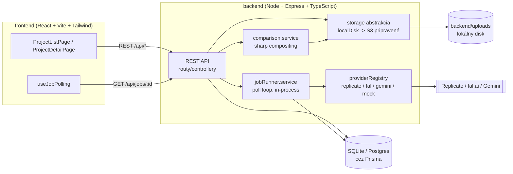

# DESIGNapp by Lucie Džama — AI vizualizácie interiérov „pred / po"

Webová aplikácia pre interiérových dizajnérov a ich klientov. Z reálnych fotiek
a pôdorysu pripraví zjednotenú fotorealistickú vizualizáciu súčasného stavu, zo
screenshotu SketchUp náčrtu vygeneruje fotorealistický render nového návrhu
(ControlNet depth+canny podmienenie zachováva geometriu náčrtu), a obe
vizualizácie zobrazí ako interaktívne porovnanie „pred / po" s exportom do PNG.

## Architektúra



**Prečo Node/Express/Prisma namiesto Python/FastAPI:** ControlNet depth/canny
preprocessing sa dá riešiť cez hostované modely na Replicate/fal.ai (žiadna
potreba lokálneho `controlnet-aux`), takže výhoda Pythonu tu odpadá. Node dáva
jeden jazyk pre celý monorepo, `sharp` (libvips) je rýchlejší ako Pillow pre
skladanie PRED/PO obrázkov, a Prisma umožňuje jednoduchý prechod SQLite → Postgres.

**Asynchrónne generovanie bez frontovacej infraštruktúry (Redis/BullMQ):**
`jobRunner.service.ts` beží ako in-process `setInterval` poll loop (max 2
súbežné joby), ktorý číta `PENDING` joby z DB a spracúva ich cez adaptér
zvoleného AI providera. Pri MVP záťaži (1 dizajnér + klient) je to dostatočné;
frontové riešenie by malo zmysel až pri horizontálnom škálovaní na viac
inštancií backendu.

## Inštalácia

Predpoklady: Node.js 20+ (testované na v24), npm.

```bash
# 1. Skopírujte .env.example
cp .env.example backend/.env
cp .env.example frontend/.env   # frontend číta len VITE_API_BASE_URL

# 2. Backend
cd backend
npm install
npx prisma migrate dev --name init   # vytvorí SQLite DB + tabuľky
npm run seed                         # voliteľné: 1 demo projekt s placeholder obrázkami
npm run dev                          # beží na http://localhost:4000

# 3. Frontend (v novom termináli)
cd frontend
npm install
npm run dev                          # beží na http://localhost:5173
```

Appka je plne funkčná bez akýchkoľvek API kľúčov — každý provider, ktorého
kľúč chýba, automaticky prepne na `MOCK` režim (vráti placeholder obrázok,
cena $0). API kľúče sa dajú zadať aj priamo v appke na stránke **/nastavenia**
(uložia sa do DB, majú prednosť pred `.env`) — po uložení sa kľúč hneď overí a
zobrazí sa farebný stav: zelená = funguje, červená = neaktívne/chýba,
oranžová = práve sa overuje.

### Testy

```bash
cd backend
npm test          # unit testy adaptérovej vrstvy (mocknuté, bez DB)
npm run test:e2e  # e2e happy-path (vlastná SQLite test DB, migruje sa automaticky)
```

## `.env` premenné

Viď [`.env.example`](.env.example) v koreni repozitára (skopírujte do `backend/.env`).

| Premenná | Popis |
|---|---|
| `PORT` | Port backendu (predvolené 4000) |
| `DATABASE_URL` | Prisma connection string (`file:./dev.db` pre SQLite dev) |
| `STORAGE_DRIVER` | `local` (disk, dev) alebo `s3` (zatiaľ neimplementované, pripravené rozhranie) |
| `UPLOADS_DIR` | Priečinok pre lokálne súbory |
| `REPLICATE_API_TOKEN` | API token z replicate.com/account/api-tokens |
| `FAL_API_KEY` | API kľúč z fal.ai/dashboard/keys |
| `GEMINI_API_KEY` | API kľúč z aistudio.google.com/apikey |
| `DEFAULT_PROVIDER` | Provider použitý, keď klient v requeste neuvedie `provider` (predvolené `MOCK`) |
| `ACCESS_PASSWORD` | Jednotné heslo pre celú appku. Prázdne = appka je bez hesla (len pre lokálny vývoj!) |
| `SESSION_SECRET` | Podpisuje prihlasovaciu cookie. V produkcii nastavte na dlhý náhodný reťazec, inak sa všetci odhlásia pri každom reštarte |
| `FRONTEND_ORIGIN` | Len ak frontend/backend bežia na rôznych origin (dva dev servery); pri same-origin produkčnom builde sa nepoužíva |
| `VITE_API_BASE_URL` | (frontend, `.env`) URL backendu pre lokálny vývoj. V `.env.production` je zámerne prázdne (relatívne API volania na rovnaký origin) |

## Ako pridať/aktualizovať AI providera

1. Vytvorte `backend/src/providers/<meno>.provider.ts`, ktorý implementuje
   rozhranie `AiProviderAdapter` z [`provider.interface.ts`](backend/src/providers/provider.interface.ts):
   `enhanceCurrentState`, `generateSketchRender`, `preprocessDepthMap`,
   `preprocessCannyEdges`, `estimateCost`, `supportsSketchRender`.
2. Chyby z API mapujte na `ProviderCallError` s kódom z `ProviderErrorCode`
   (`ERR_TIMEOUT`, `ERR_RATE_LIMITED`, `ERR_INVALID_INPUT`,
   `ERR_PROVIDER_ERROR`, `ERR_UNSUPPORTED_PROVIDER_FOR_MODULE`) — `withRetry()`
   sa podľa kódu rozhodne, či má zmysel opakovať volanie.
3. Zaregistrujte nového providera v mape `ADAPTERS` v
   [`providerRegistry.ts`](backend/src/providers/providerRegistry.ts) a doplňte
   cenu do [`providerPricing.ts`](backend/src/config/providerPricing.ts).
4. Kľúč sa číta cez [`credentials.service.ts`](backend/src/services/credentials.service.ts)
   (`getApiKey('NAZOV')`) — DB záznam z /nastavenia má prednosť, `.env`
   premenná (doplňte do `.env.example` a `config/env.ts`) slúži ako záloha.
5. Implementujte `testConnection()` — ideálne voľné/bezplatné API volanie
   (napr. Replicate `GET /v1/account`, Gemini `GET /v1beta/models`), ktoré
   overí kľúč bez toho, aby stálo peniaze. Ak provider nemá takú možnosť,
   radšej len skontrolujte formát kľúča a jasne to okomentujte (viď
   `fal.provider.ts`) - nehádajte neexistujúci endpoint.
6. Ak provider nepodporuje Modul C (sketch → render), nastavte
   `supportsSketchRender = false` — API vráti `ERR_UNSUPPORTED_PROVIDER_FOR_MODULE`.

Existujúce adaptéry (`replicate.provider.ts`, `fal.provider.ts`) majú model
ID/verzie označené ako placeholdery — pred nasadením ich treba nahradiť
reálnymi hodnotami z dokumentácie providera a otestovať s ostrým API kľúčom.

## Nasadenie do produkcie (Railway)

Appka je navrhnutá tak, aby bežala ako **jedna Railway služba** — Express
backend v produkcii servíruje aj zostavený frontend (`npm run build` skopíruje
`frontend/dist` do `backend/public`, viď [`staticFrontend.ts`](backend/src/staticFrontend.ts)
a [`scripts/copy-frontend-dist.mjs`](scripts/copy-frontend-dist.mjs)). Vďaka
tomu bežia frontend aj API na rovnakej doméne — žiadne cross-origin
komplikácie s prihlasovacou cookie.

1. **Push na GitHub** — repo musí byť na GitHube, aby sa dalo pripojiť k Railway (viď nižšie).
2. Na [railway.app](https://railway.app) vytvorte nový projekt → **Deploy from GitHub repo** → vyberte tento repozitár.
3. Railway z koreňového [`package.json`](package.json) automaticky zistí a spustí:
   - build: `npm run build` (zostaví frontend, skopíruje ho do `backend/public`, zostaví backend)
   - štart: `npm start` (spustí `prisma migrate deploy` a potom server)
4. Pridajte **Volume** (trvalý disk) pripojený napr. na `/app/backend` — SQLite databáza (`dev.db`) aj nahraté súbory (`backend/uploads`) musia prežiť redeploy.
5. V Railway nastavte premenné prostredia (Settings → Variables) — minimálne:
   - `DATABASE_URL=file:./dev.db` (alebo pripojte Railway Postgres a zmeňte `provider` v `prisma/schema.prisma` na `postgresql`)
   - `NODE_ENV=production`
   - `ACCESS_PASSWORD=` (zvoľte si heslo)
   - `SESSION_SECRET=` (dlhý náhodný reťazec, napr. `openssl rand -hex 32`)
   - API kľúče (`REPLICATE_API_TOKEN`, `FAL_API_KEY`, `GEMINI_API_KEY`) sú voliteľné — dajú sa doplniť neskôr priamo cez `/nastavenia` v appke.
6. Railway pridelí appke verejnú URL (`https://....up.railway.app`) — appka je online.

## Známe limity MVP

- **Bez platieb a NeRF/Gaussian splatting 3D rekonštrukcie** — zámerne mimo
  rozsahu MVP, sú kandidátmi na ďalšie kroky. Prihlasovanie je riešené
  jednoduchým zdieľaným heslom (`ACCESS_PASSWORD`), nie plnohodnotnými
  používateľskými účtami/rolami.
- Model ID/verzie pre Replicate a fal.ai sú zatiaľ placeholder hodnoty (pozri
  vyššie) — vyžadujú overenie s reálnymi API kľúčmi.
- Gemini adaptér podporuje len Modul B (nemá ControlNet-style depth+canny
  podmienenie potrebné pre Modul C).
- Modul D nerobí žiadne automatické zarovnanie/warping obrázkov — spolieha sa
  na to, že si používateľ pripraví rovnaký kamerový uhol (napr. cez SketchUp
  *Camera → Match New Photo*).
- Cenník je statický, ručne udržiavaný súbor — nie je naviazaný na reálne
  fakturačné API providerov a časom sa môže rozchádzať od skutočných nákladov.
- Job runner beží in-process (žiadny Redis/queue) — vhodné pre jednu inštanciu
  backendu; horizontálne škálovanie by vyžadovalo prechod na skutočnú frontu.
- Mazanie projektu/assetu maže DB záznamy okamžite, súbory na disku sa mažú
  best-effort — občasný "orphaned files" sweep nie je súčasťou MVP.
- Úložisko do S3 (`storage/s3Storage.ts`) je len pripravené rozhranie, nie je
  implementované — pre produkciu treba doplniť AWS SDK volania.

## Ďalšie kroky (mimo MVP)

- Plnohodnotné používateľské účty a role (dizajnér vs. klient) namiesto
  jedného zdieľaného hesla
- Platby a fakturácia
- 3D rekonštrukcia z fotiek (NeRF / Gaussian splatting) namiesto ručného
  SketchUp náčrtu
- Automatické zarovnanie PRED/PO obrázkov (homografia/warping) namiesto
  spoliehania sa na zhodný kamerový uhol
- Reálna fronta (BullMQ + Redis) pri väčšej záťaži/škálovaní
